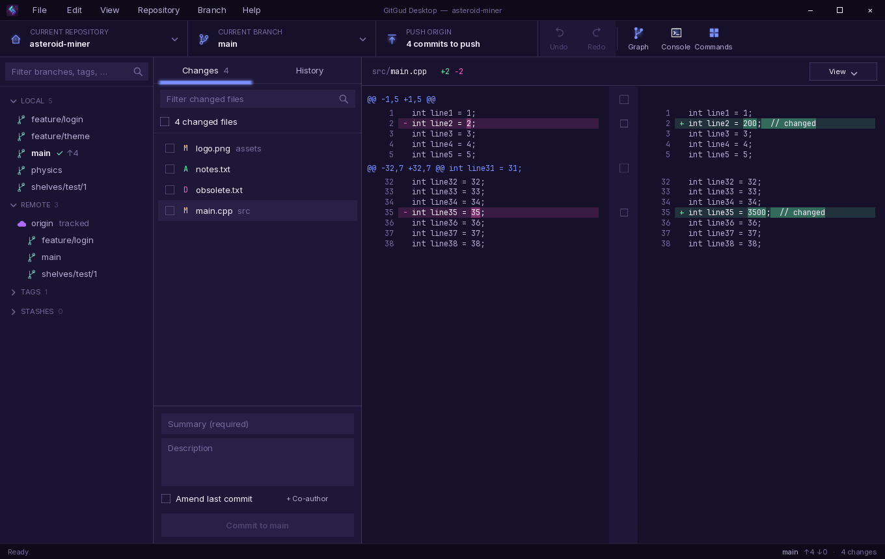
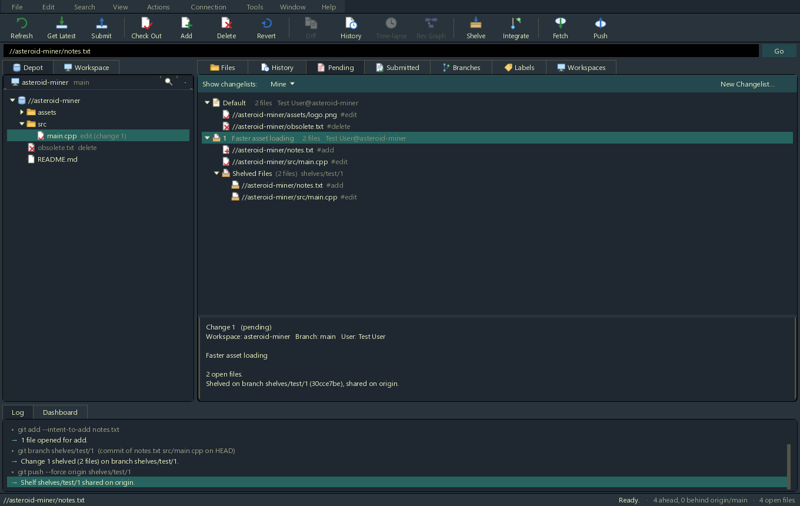
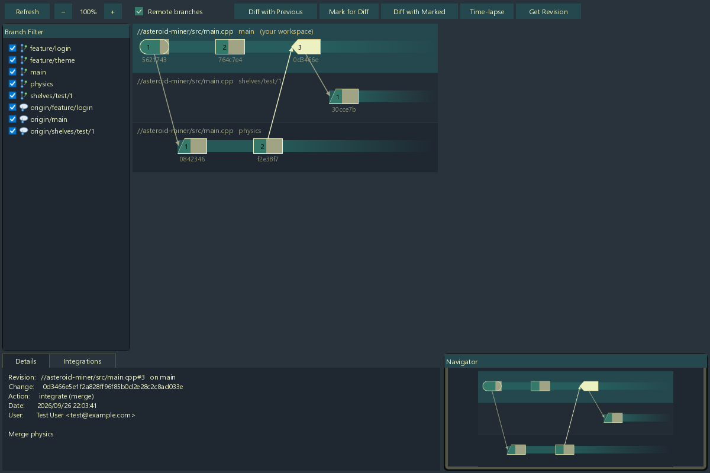

# GitGud Desktop

A Git client you can reshape. The engine is native C++ over libgit2; the
interface above it — layouts, skin, menus, shortcuts, workflows — is XML and
Lua that reloads while the app runs, so you can restyle it, rearrange it, or
build your own features without recompiling. Works with any Git server; no
account required.

It comes with two complete interfaces to start from.

## Two interfaces — or your own

**The default interface**, in the GitHub Desktop tradition: changes and
history side by side, line-level staging, a commit graph, a branch tree,
undo, interactive rebase, a merge tool, and a console.



**A P4V-style interface**, laid out like Perforce's P4V in the Dagobah
palette: a depot and workspace tree, pending changelists you can shelve and
share, submitted changelists, labels, and separate Diff, Revision Graph,
Time-lapse, and Folder Diff windows. Git has no changelists, so they're kept
locally; shelving a changelist puts its files on a branch of their own,
which you can push for others to unshelve.





GitGud asks which one you'd like on first launch. Switch whenever you like
from **File ▸ Switch user interface…** in the default interface, or
**Edit ▸ Preferences ▸ Switch User Interface…** in the P4V one — your
repositories and settings come along.

**Build your own.** An interface is just a folder: `scripts/main.lua` and
`layouts/main.xml`, with the default interface's Lua toolkit (menus,
dialogs, the command palette) and layouts there to reuse. Point GitGud at
the folder with **Use an interface from a folder…** in the picker. See
[Modding ▸ Your own interface](https://github.com/Forasp/GitGudDesktop/wiki/Modding#9-your-own-interface).

## Documentation

Everything lives in the **[wiki](https://github.com/Forasp/GitGudDesktop/wiki)**:
[Modding](https://github.com/Forasp/GitGudDesktop/wiki/Modding) ·
[Lua API](https://github.com/Forasp/GitGudDesktop/wiki/Lua-API) ·
[Building](https://github.com/Forasp/GitGudDesktop/wiki/Building) ·
[Using the Default UI](https://github.com/Forasp/GitGudDesktop/wiki/Using-the-Default-UI) ·
[Using the P4V UI](https://github.com/Forasp/GitGudDesktop/wiki/Using-the-P4V-UI) ·
[Principles](https://github.com/Forasp/GitGudDesktop/wiki/Principles)

## Build

Windows, Visual Studio 2022+ (C++ workload), and Git:

```powershell
.\setup.cmd
```

That sets up the dev environment, the CEGUI submodule and its build, and the
app. See [Building](https://github.com/Forasp/GitGudDesktop/wiki/Building)
for presets, tests, and packaging.

## License

[MIT](LICENSE)
