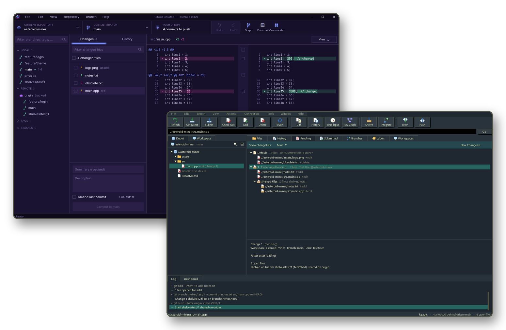

# GitGud Desktop

A Git client you can reshape. The engine is native C++ over libgit2; the
interface above it (layouts, skin, menus, shortcuts, workflows) is XML and
Lua that reloads while the app runs, so you can restyle it, rearrange it, or
build your own features without recompiling. Works with any Git server; no
account required.

## Getting started

1. Download the **[installer](https://github.com/Forasp/GitGudDesktop/releases/latest/download/GitGud-win64-setup.exe)**
   and run it, or the **[zip](https://github.com/Forasp/GitGudDesktop/releases/latest/download/GitGud-win64.zip)**
   to unzip anywhere and run `gitgud.exe` without installing. Other versions
   and release notes are on the
   [releases page](https://github.com/Forasp/GitGudDesktop/releases).
2. Start GitGud. Next time it reopens the repository you had open.
3. Pick an interface, then add a repository: clone one, create one, or open a
   folder you already have.

Windows, 64-bit.

## Two prebuilt interfaces, or build your own

Default interfaces similar to other popular revision control software.



See [Modding ▸ Your own interface](https://github.com/Forasp/GitGudDesktop/wiki/Modding#9-your-own-interface).

## Documentation

Everything lives in the **[wiki](https://github.com/Forasp/GitGudDesktop/wiki)**:
[Modding](https://github.com/Forasp/GitGudDesktop/wiki/Modding) ·
[Lua API](https://github.com/Forasp/GitGudDesktop/wiki/Lua-API) ·
[Building](https://github.com/Forasp/GitGudDesktop/wiki/Building) ·
[Using the Default UI](https://github.com/Forasp/GitGudDesktop/wiki/Using-the-Default-UI) ·
[Using the Depot UI](https://github.com/Forasp/GitGudDesktop/wiki/Using-the-Depot-UI) ·
[Principles](https://github.com/Forasp/GitGudDesktop/wiki/Principles)

## Build

Windows, Visual Studio 2022+ (C++ workload), and Git:

```powershell
.\setup.cmd
```

That sets up the dev environment, the CEGUI submodule and its build, and the
app. See [Building](https://github.com/Forasp/GitGudDesktop/wiki/Building)
for presets, tests, and packaging.

## Credits

Built on [libgit2](https://libgit2.org), [CEGUI](https://github.com/cegui/cegui),
[SDL](https://libsdl.org), [Lua](https://www.lua.org),
[OpenSSL](https://www.openssl.org), and [FreeType](https://freetype.org),
among others; the interface uses the [Inter](https://rsms.me/inter/) and
[JetBrains Mono](https://www.jetbrains.com/lp/mono/) fonts.
Portions of this software are copyright © The FreeType Project
(https://freetype.org). All rights reserved.

Every third-party component and its license is listed in
[THIRD_PARTY_NOTICES.txt](THIRD_PARTY_NOTICES.txt), which also ships with
each download.

## License

[MIT](LICENSE)
